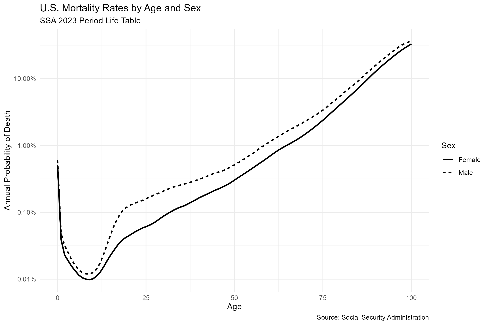
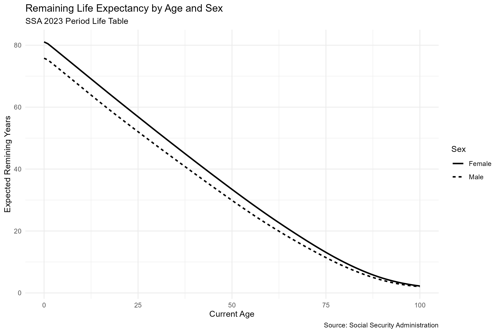

# US-Mortality-Analysis
Analysis of U.S. mortality data using R programming.

## Overview
- Analyzed U.S. mortality data to explore mortality patterns across age groups in male and female population.
- Cleaned mortality data using tidyverse functions.
- Grouped and summarized data to identify patters and differences across age groups.
- Created visualizations to communicate mortality trends using ggplot2.

### Mortality Rate

### Remaining Life Expectancy

